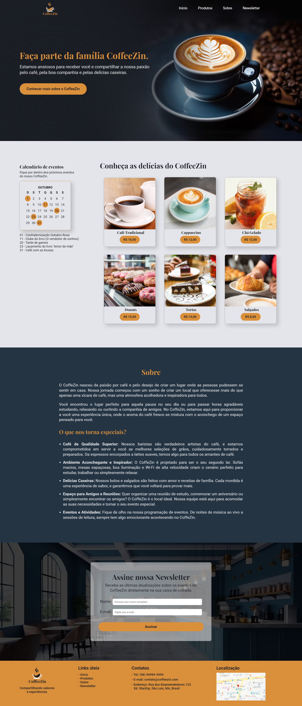

<h1 align="center"> Website CoffeeZin ☕ </h1>

  <a href="#-tecnologias">Tecnologias</a>&nbsp;&nbsp;&nbsp;|&nbsp;&nbsp;&nbsp;
  <a href="#-projeto">Projeto</a>

 

  

 

## 💻 Projeto

O projeto é um website para a cafeteria chamada CoffeeZin. Tal projeto foi proposto na aula do curso **Vem Ser Tech - Front-End da Ada Tech em parceria com o iFood** e um dos maiores desafios é a não utilização de Flexbox ou Grid para o posicionamento dos elementos.
  

## 🚀 Tecnologias

Esse projeto foi desenvolvido com as seguintes tecnologias:

- HTML
- CSS
  
